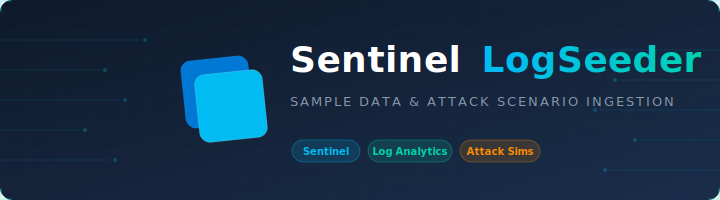

<p align="center">
  
</p>

# 🧪 Sentinel LogSeeder — Sample Data & Attack Scenario Ingestion

A Microsoft Sentinel toolkit for generating and ingesting **realistic sample data** into Log Analytics tables via the Azure Monitor Logs Ingestion API. Supports both single-table ingestion and **multi-table attack scenarios** that simulate coordinated threat activity across correlated tables.

---

## 🎯 What does this do?

| Capability | Description |
|---|---|
| **Product-level ingestion** | Ask the agent to ingest sample data for a product (e.g., "ingest data for CrowdStrike" or "ingest data for AWS GuardDuty") and it will automatically research the associated Sentinel tables and APIs, build schemas, and handle the full ingestion pipeline. |
| **Single-table ingestion** | Generate randomized sample data for any Sentinel / Log Analytics table — built-in or custom (`_CL`). The agent discovers the schema, researches realistic field values, deploys infrastructure (DCE, DCR, custom table), and ingests data. |
| **Sample file ingestion** | Provide a JSON or CSV file with log records and the agent will analyze the data, identify the target table, build the schema, and ingest it — no manual schema authoring needed. |
| **Attack scenario ingestion** | Ingest **coordinated events across multiple tables** that tell a coherent attack story (e.g., brute-force login → lateral movement → ransomware deployment). Entities are correlated across tables with realistic timing. The agent lets the user **choose which product to use for each stage** of the attack (e.g., CrowdStrike for endpoint events, AWS for cloud trail logs), so scenarios can span multiple vendor data sources. |
| **Entity seeding** | All generated data draws from configurable entity pools (users, IPs, devices, domains, URLs) for consistency across tables and scenarios. |

---

## 📂 Project Structure

| Folder / File | Purpose |
|---|---|
| `scripts/Invoke-SampleDataIngestion.ps1` | Core engine — deploys infrastructure and ingests sample data for a single table |
| `scripts/Invoke-AttackScenarioIngestion.ps1` | Orchestrator — reads a scenario definition and ingests correlated data across multiple tables |
| `config/workspace.json` | Workspace coordinates (tenant, subscription, resource group, workspace ID) |
| `config/entities.json` | Entity pools (users, IPs, devices, domains, URLs, emails) shared across all ingestion |
| `schemas/` | Table schema definitions (JSON) — created by the agent or manually. Pre-populated with most built-in schemas that support direct ingestion  |
| `samples/` | Sample data files (JSON/CSV) for realistic value distributions |
| `scenarios/` | Attack scenario definitions (JSON) — pre-built and custom |
| `SKILL.md` | AI agent skill file for GitHub Copilot-driven ingestion workflows |
| `.github/` | GitHub Copilot agent definition and instructions |

---

## 🚀 Quick Start

### Prerequisites

- **GitHub Copilot** — an active GitHub Copilot subscription is required to use the AI-driven ingestion workflows
- **Azure CLI** (`az`) installed and authenticated (`az login`)
- **PowerShell 7+** recommended
- A **Log Analytics workspace** with Microsoft Sentinel enabled
- **Azure RBAC permissions** on the target resource group:
  - **Contributor** — to create Data Collection Endpoints (DCE), Data Collection Rules (DCR), and custom tables
  - **User Access Administrator** — to assign the `Monitoring Metrics Publisher` role on the DCR (required for data ingestion)

> The agent handles creating the DCE, DCR, and custom tables, and assigns the `Monitoring Metrics Publisher` role automatically.

### 1. Configure your workspace

Rename `config/workspace.json.template` to `config/workspace.json`

Then edit `config/workspace.json` with your values:

```json
{
  "tenantId": "<your-tenant-id>",
  "subscriptionId": "<your-subscription-id>",
  "resourceGroup": "<your-resource-group>",
  "workspaceName": "<your-workspace-name>",
  "workspaceId": "<your-workspace-id>"
}
```

> **Note:** `config/workspace.json` is in `.gitignore` and will never be committed.

### 2. Ingest sample data for a single table

Sample GitHub Copilot prompts:

> *"Ingest sample data for the `AWSCloudTrail` table"*

> *"Ingest sample data for `Proofpoint TAP`"*

> *"Ingest this sample file into Sentinel"* (attach or reference a JSON/CSV file with log records)

### 3. Ingest an attack scenario

Sample GitHub Copilot prompts:

> *"Run the brute-force-lateral-movement attack scenario"*

> *"Ingest sample data that simulates the data exfiltration attack scenario"*


---

## � Supported Tables

This tool uses the [Azure Monitor Logs Ingestion API](https://learn.microsoft.com/azure/azure-monitor/logs/logs-ingestion-api-overview) to send data. The API only supports ingestion into **custom log tables** (with a `_CL` suffix) and a specific set of **built-in Azure tables**. You **cannot** ingest data into vendor-managed tables such as `SigninLogs`, `AuditLogs`, `DeviceProcessEvents`, etc. — those are populated exclusively by their respective products.

| Table Type | Supported? | Notes |
|---|---|---|
| **Custom tables (`_CL`)** | ✅ Yes | Any custom table you create in your Log Analytics workspace. Must exist before ingestion. |
| **Built-in Azure tables** (listed below) | ✅ Yes | Only the specific tables listed below accept data via the Logs Ingestion API. |
| **Vendor-managed tables** (e.g., `SigninLogs`, `DeviceProcessEvents`) | ❌ No | Read-only — populated by their respective services. Use ASIM normalized tables or `SecurityEvent` as alternatives. |

<details>
<summary><b>Full list of supported built-in Azure tables</b></summary>

Source: [Logs Ingestion API — Supported Tables](https://learn.microsoft.com/azure/azure-monitor/logs/logs-ingestion-api-overview#supported-tables)

**ASIM Normalized Tables:**
`ASimAuditEventLogs`, `ASimAuthenticationEventLogs`, `ASimDhcpEventLogs`, `ASimDnsActivityLogs`, `ASimFileEventLogs`, `ASimNetworkSessionLogs`, `ASimProcessEventLogs`, `ASimRegistryEventLogs`, `ASimUserManagementActivityLogs`, `ASimWebSessionLogs`

**Security & Monitoring:**
`Anomalies`, `CommonSecurityLog`, `DnsAuditEvents`, `Event`, `SecurityEvent`, `Syslog`, `ThreatIntelIndicators`, `ThreatIntelligenceIndicator`, `ThreatIntelObjects`, `WindowsEvent`

**SAP:**
`ABAPAuditLog`, `ABAPAuthorizationDetails`, `ABAPChangeDocsLog`, `ABAPUserDetails`

**AWS:**
`AWSALBAccessLogs`, `AWSCloudTrail`, `AWSCloudWatch`, `AWSEKS`, `AWSELBFlowLogs`, `AWSGuardDuty`, `AWSNetworkFirewallAlert`, `AWSNetworkFirewallFlow`, `AWSNetworkFirewallTls`, `AWSNLBAccessLogs`, `AWSRoute53Resolver`, `AWSS3ServerAccess`, `AWSSecurityHubFindings`, `AWSVPCFlow`, `AWSWAF`

**GCP:**
`GCPApigee`, `GCPAuditLogs`, `GCPCDN`, `GCPCloudRun`, `GCPCloudSQL`, `GCPComputeEngine`, `GCPDNS`, `GCPFirewallLogs`, `GCPIAM`, `GCPIDS`, `GCPMonitoring`, `GCPNAT`, `GCPNATAudit`, `GCPResourceManager`, `GCPVPCFlow`

**GKE:**
`GKEAPIServer`, `GKEApplication`, `GKEAudit`, `GKEControllerManager`, `GKEHPADecision`, `GKEScheduler`

**Google:**
`GoogleCloudSCC`, `GoogleWorkspaceReports`

**CrowdStrike:**
`CrowdStrikeAlerts`, `CrowdStrikeAPIActivityAudit`, `CrowdStrikeAuthActivityAudit`, `CrowdStrikeCases`, `CrowdStrikeCSPMIOAStreaming`, `CrowdStrikeCSPMSearchStreaming`, `CrowdStrikeCustomerIOC`, `CrowdStrikeDetections`, `CrowdStrikeHosts`, `CrowdStrikeIncidents`, `CrowdStrikeReconNotificationSummary`, `CrowdStrikeRemoteResponseSessionEnd`, `CrowdStrikeRemoteResponseSessionStart`, `CrowdStrikeScheduledReportNotification`, `CrowdStrikeUserActivityAudit`, `CrowdStrikeVulnerabilities`

**Sentinel:**
`SentinelAlibabaCloudAPIGatewayLogs`, `SentinelAlibabaCloudVPCFlowLogs`, `SentinelAlibabaCloudWAFLogs`, `SentinelTheHiveData`

**Azure & Storage:**
`AzureAssessmentRecommendation`, `AzureMetricsV2`, `StorageInsightsAccountPropertiesDaily`, `StorageInsightsDailyMetrics`, `StorageInsightsHourlyMetrics`, `StorageInsightsMonthlyMetrics`, `StorageInsightsWeeklyMetrics`

**Threat Intelligence:**
`ThreatIntelIndicators`, `ThreatIntelligenceIndicator`, `ThreatIntelObjects`

**Assessment & Compliance:**
`ADAssessmentRecommendation`, `ADSecurityAssessmentRecommendation`, `ExchangeAssessmentRecommendation`, `ExchangeOnlineAssessmentRecommendation`, `SCCMAssessmentRecommendation`, `SCOMAssessmentRecommendation`, `SfBAssessmentRecommendation`, `SfBOnlineAssessmentRecommendation`, `SharePointOnlineAssessmentRecommendation`, `SPAssessmentRecommendation`, `SQLAssessmentRecommendation`, `WindowsClientAssessmentRecommendation`, `WindowsServerAssessmentRecommendation`

**Update Compliance:**
`UCClient`, `UCClientReadinessStatus`, `UCClientUpdateStatus`, `UCDeviceAlert`, `UCDOAggregatedStatus`, `UCDOStatus`, `UCServiceUpdateStatus`, `UCUpdateAlert`

**Other:**
`DeviceTvmSecureConfigurationAssessmentKB`, `DeviceTvmSoftwareVulnerabilitiesKB`, `IlumioInsights`, `OTelLogs`, `QualysKnowledgeBase`, `Rapid7InsightVMCloudAssets`, `Rapid7InsightVMCloudVulnerabilities`

</details>

> **Tip:** If a table is NOT in this list and is NOT a custom `_CL` table, you cannot ingest data into it. Use the corresponding ASIM normalized table or `SecurityEvent` as an alternative.

---

## 🗡️ Pre-built Attack Scenarios

| Scenario | Tables | Description |
|---|---|---|
| [Brute Force + Lateral Movement](scenarios/brute-force-lateral-movement.json) | Authentication, NetworkSession, ProcessEvent | Repeated auth failures from external IP → successful login → RDP session to internal host → process execution |
| [Ransomware Deployment](scenarios/ransomware-deployment.json) | Authentication, ProcessEvent, FileEvent, RegistryEvent | Phishing-compromised account → malicious process execution → mass file encryption → registry persistence |
| [Data Exfiltration](scenarios/data-exfiltration.json) | AuditEvent, FileEvent, NetworkSession, Dns | Privileged access to sensitive resources → bulk file reads → large outbound transfers → DNS tunneling |
| [Credential Theft + Privilege Escalation](scenarios/credential-theft-privesc.json) | Authentication, ProcessEvent, UserManagement | Compromised account → LSASS memory dump → new admin user creation → elevated session |

---

## 📋 Attack Scenario Format

Scenarios are defined in JSON with correlated entities and timed event phases:

```json
{
  "name": "scenario-name",
  "description": "What this scenario simulates",
  "tables": {
    "Authentication": { "schema": "schemas/Authentication.json", "rowCount": 50 },
    "ProcessEvent": { "schema": "schemas/ProcessEvent.json", "rowCount": 20 }
  },
  "timeline": [
    {
      "phase": "Initial Access",
      "offsetMinutes": 0,
      "durationMinutes": 30,
      "table": "Authentication",
      "eventTemplate": { ... },
      "count": 25
    }
  ],
  "actors": {
    "attacker": { "ip": "external", "username": null },
    "victim": { "username": "random", "device": "random" }
  }
}
```

See [scenarios/_template.json](scenarios/_template.json) for the full schema.

---

## 🔧 Configuration

### Entity Pools (`config/entities.json`)

Customize the users, IPs, devices, domains, and URLs used in generated data. All ingestion — both single-table and attack scenarios — draws from these pools for consistency.

### Workspace Config (`config/workspace.json`)

Workspace coordinates used by all scripts. Both ingestion scripts accept `-WorkspaceConfig` and `-EntitiesFile` parameters to override defaults.

---

## ❓ Troubleshooting

| Issue | Resolution |
|---|---|
| `403 Forbidden` on ingestion | Assign `Monitoring Metrics Publisher` role on the DCR to the signed-in user |
| `InvalidStream` error | DCR hasn't propagated yet — the script retries automatically |
| Data not visible | Ingestion delay is typically 5–10 minutes for newly created tables |

---

## 📄 License

This project is licensed under the [MIT License](LICENSE).
